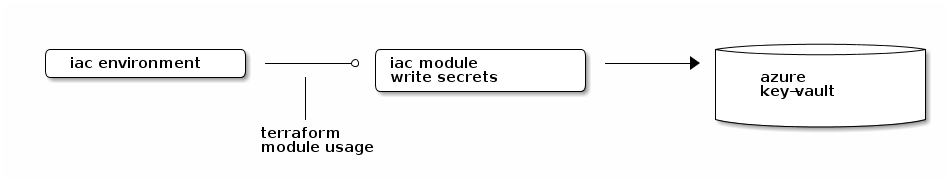

# Using for_each with sensitive Values

## Overview



Suppose you have this key-value datastructure with secrets you want to store in an azure key-vault.

```
locals {
  secrets = {
    key123 = {
      value = "the-very-secret-password"
    },
    auth-token = {
      value = "the-secret-token"
    }
  }
}

```

The interface in your tf module *write-secrets* looks this: 


```
variable "secret" {

  type = map(object({
    value = string
  }))
  sensitive = true  // terraform will enforce that your secret values are marked sensitive
                    // when you store information like tokens or passwords 
}

``` 


## The problem

you cannot iterate over the sensitive keys, although only the values and not the keys contain sensitive information.


```
$ terraform plan

 Error: Invalid for_each argument
 
   on ../captain-k8s-iac-modules/write-azure-key-vault-secrets/main.tf line 19, in resource "azurerm_key_vault_secret" "this":
   19:   for_each     = var.secret
     ├────────────────
     │ var.secret has a sensitive value
 
 Sensitive values, or values derived from sensitive values, cannot be used as for_each arguments. 
 If used, the sensitive value could be exposed as a resource instance key.

```

## function nonsensitive() 

By explicitly marking the keys as nonsensitive values, you can safely iterate:

```
resource "azurerm_key_vault_secret" "this" {

  for_each     = nonsensitive(var.secret)
  name         = each.key
  value        = lookup(each.value, "value")
  key_vault_id = var.key_vault_id
}
```

```
$ terraform plan

Terraform used the selected providers to generate the following execution plan. Resource actions are indicated with the following symbols:
  + create

Terraform will perform the following actions:

  # module.write-azure-key-vault-secrets.azurerm_key_vault_secret.this["key123"] will be created
  + resource "azurerm_key_vault_secret" "this" {
      + id                      = (known after apply)
      + key_vault_id            = "/subscriptions/964df7ca-yyyy-0000-xxxx-1ed9db5723f8/resourceGroups/1-45e433a8-playground-sandbox/providers/Microsoft.KeyVault/vaults/captain-k8s-key-vault"
      + name                    = "key123"
      + resource_id             = (known after apply)
      + resource_versionless_id = (known after apply)
      + value                   = (sensitive value)
      + version                 = (known after apply)
      + versionless_id          = (known after apply)
    }

Plan: 1 to add, 0 to change, 0 to destroy.

```


