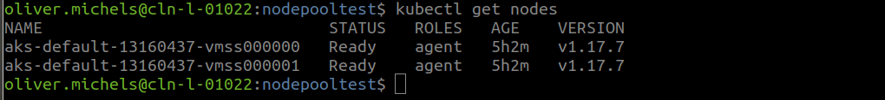

# How to achieve zero downtime of Kubernetes Services with Azure

Upgrading of Kubernetes Cluster onto a new version is no easy task, but doable!
The trick is to establish a workflow and stick to it. It looks like this:

## Use a cluster containing of 2 node pools

We enhance our cluster with an addional nodepool, which will host the running
services, while we are upgrading the first nodepool onto a higher version.

`$ export RESOURCE_GROUP=rg-aks-test; export CLUSTER_NAME=k8scluster`

I will reuse these environment Vars in this example

`$ az aks nodepool add --resource-group $RESOURCE_GROUP  --cluster-name $CLUSTER_NAME --node-vm-size Standard_DS2_v2 --name second --node-count 2`

## Now We are running a cluster with 2 node pools, next step is to shift all running services onto the new cluster nodes

`$ kubectl get nodes -o wide` 

NAME | STATUS | ROLES | AGE | VERSION
---- | ------ | ----- | --- | ------- 
aks-default-13160437-vmss000000 | Ready | agent | 3h59m | v1.17.7
aks-default-13160437-vmss000001 | Ready | agent  3h59m | v1.17.7
aks-second-13160437-vmss000000 | Ready | agent | 46m | v1.17.7
aks-second-13160437-vmss000001 |  Ready | agent | 47m  | v1.17.7

## Now we can just disable the nodes on the first node pool, all pods get evicted and are restarted on the other node pool. Just take care that your replica count is greater than 1

`$ kubectl drain aks-default-13160437-vmss000000`

`$ kubectl drain aks-default-13160437-vmss000001` 

Now all pods will get evicted from the first nodepool and get restarted on the second nodepool, enabling a safe upgrade of the unused nodes in the first pool.

## Next step is upgrade the k8s control plane onto the new version.

`$ az aks get-upgrades --resource-group $RESOURCE_GROUP --name $CLUSTER_NAME` 

and the pick your version (i'm using 1.17.9 here as an example)

`$ az aks upgrade --resource-group $RESOURCE_GROUP  --name $CLUSTER_NAME --kubernetes-version 1.17.9 --control-plane-only` 

## After having upgraded the control plane, we can upgrade the first node pool

`$ az aks nodepool upgrade --resource-group $RESOURCE_GROUP  --cluster-name $CLUSTER_NAME --kubernetes-version 1.17.9 --name default ` 

## The next step is simple, just uncordon all nodes in the node pool *default* and drain each node in node pool *second*

The upgrade process uncordons all nodes in the upgraded pool, just check that and then drain each node in the other pool.
This way all your pods will migrate back to the default pool, which is now running on the higher version.

## Finally you can upgrade the node pool *second* or just delete it. 

But be aware that you need at least one node pool in the status of *System*, otherwise you won't be able to delete it.

`$ az aks nodepool update --resource-group $RESOURCE_GROUP --cluster-name $CLUSTER_NAME --name default --mode System`

`$ az aks nodepool delete --resource-group $RESOURCE_GROUP --cluster-name $CLUSTER_NAME --name second`

 
